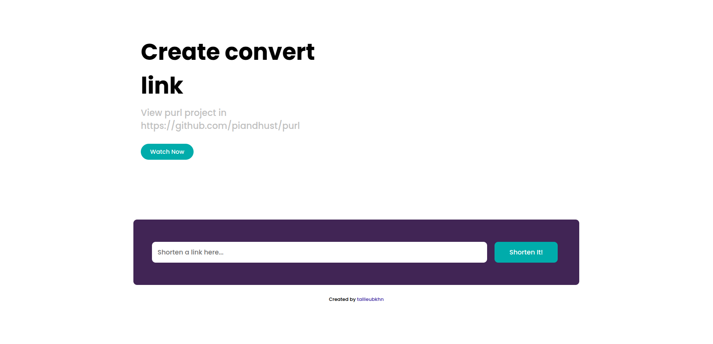

## Demo

Root URL: [https://github.com/piandhust/purl](https://github.com/piandhust/purl)

After convert: [https://piandhust.github.io/purl?redirect=aHR0cHM6Ly9naXRodWIuY29tL3BpYW5kaHVzdC9wdXJs](https://piandhust.github.io/purl?redirect=aHR0cHM6Ly9naXRodWIuY29tL3BpYW5kaHVzdC9wdXJs)

URL hidden and access via your website, website can place ads, see below: 

## How to run

Open VS Code and run with live server
